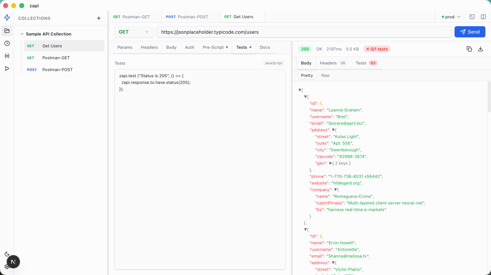

<div align="center">
  
  <br/>
  <br/>
  <strong>快速、现代、本地优先的 API 测试客户端</strong>
  <br/>
  基于 Tauri 2 · Next.js 15 · Rust 构建
  <br/><br/>

  [🇺🇸 English](README.md)
</div>

---



## ✨ 功能特性

- **请求编辑器** — 完整 HTTP 方法支持（GET、POST、PUT、PATCH、DELETE、HEAD、OPTIONS），含 Params / Headers / Body / Auth 标签页
- **脚本引擎** — 通过 `zapi.*` API（兼容 Postman）编写前置脚本和测试断言，并捕获 `console.log` 输出
- **控制台面板** — 类 Chrome DevTools 的底部面板，实时展示脚本日志及 HTTP 请求/响应记录
- **环境变量** — 创建命名环境，管理变量，按请求覆盖；环境变量优先于集合变量
- **集合 & Runner** — 将请求组织为集合，支持顺序执行（功能模式）或负载测试（性能模式）
- **性能测试** — 基于 Rust 的并发 HTTP 压测（灵感来自 [rs-wrk](https://github.com/codeb2cc/rs-wrk)）：可配置并发连接数、持续时间、限速、超时、每请求延迟百分位
- **实时统计** — 压测过程中实时展示 TPS、错误率和延迟（通过 Tauri 事件系统）
- **运行报告** — 功能报告含逐请求通过/失败及断言详情；性能报告含 p50/p90/p99/p99.9 延迟分布
- **一键重跑** — 保留原始请求顺序，一键重新执行报告
- **布局切换** — 垂直（上下堆叠）与水平（左右并排）请求/响应面板自由切换
- **历史记录** — 完整请求历史，一键重放
- **深色 / 浅色模式** — 跟随系统主题自动切换

## 🛠 技术栈

| 层级 | 技术 |
|---|---|
| 桌面壳 | [Tauri 2](https://v2.tauri.app/)（Rust） |
| 前端 | [Next.js 15](https://nextjs.org/) · React 19 · TypeScript |
| 样式 | [Tailwind CSS v4](https://tailwindcss.com/) |
| UI 组件 | [Radix UI](https://www.radix-ui.com/) |
| 状态管理 | [Zustand](https://github.com/pmndrs/zustand) + `persist` |
| HTTP 客户端（性能测试） | [reqwest](https://github.com/seanmonstar/reqwest)（Rust，异步） |

## 🚀 快速开始

### 环境要求

- [Node.js](https://nodejs.org/) ≥ 20
- [pnpm](https://pnpm.io/)
- [Rust](https://rustup.rs/) stable 工具链
- 各平台 Tauri 依赖 — 参见 [Tauri 前置要求](https://v2.tauri.app/start/prerequisites/)

### 开发模式

```bash
git clone https://github.com/yourname/zapi
cd zapi
pnpm install
pnpm tauri dev
```

应用将在 Tauri 窗口中打开，Next.js 开发服务器运行于 `http://localhost:3000`。

### 生产构建

```bash
# macOS
pnpm tauri build

# macOS（Intel）
pnpm tauri build --target x86_64-apple-darwin

# Windows（交叉编译）
pnpm tauri build --runner cargo-xwin --target x86_64-pc-windows-msvc
```

### 移动端（实验性）

```bash
# Android
pnpm tauri android init
pnpm tauri android build --apk

# iOS
pnpm tauri ios init
pnpm tauri ios build
```

## 📁 项目结构

```
zapi/
├── src/                    # Next.js 前端
│   ├── app/                # App Router 页面与布局
│   ├── components/         # React 组件
│   │   ├── RequestEditor.tsx
│   │   ├── ResponseViewer.tsx
│   │   ├── RunnerPanel.tsx
│   │   ├── RunnerReport.tsx
│   │   ├── ConsolePanel.tsx
│   │   └── ...
│   └── lib/                # 状态、类型、工具函数
│       ├── store.ts        # Zustand 状态仓库
│       ├── types.ts        # 共享 TypeScript 类型
│       ├── pm.ts           # zapi.* 脚本引擎
│       └── http-client.ts  # HTTP 执行层
├── src-tauri/              # Tauri / Rust 后端
│   ├── src/lib.rs          # Rust 性能测试引擎
│   └── tauri.conf.json
└── public/                 # 静态资源与 Logo
```

## 🧪 脚本 API（`zapi.*`）

前置脚本与测试均使用暴露为 `zapi` 的 Postman 兼容 API：

```javascript
// 前置脚本：在请求发送前执行
zapi.environment.set("token", "abc123");
zapi.request.headers.add({ key: "Authorization", value: "Bearer " + zapi.environment.get("token") });

// 测试：在收到响应后执行
zapi.test("状态码为 200", () => {
  zapi.response.to.have.status(200);
});

zapi.test("包含用户 ID", () => {
  const json = zapi.response.json();
  zapi.expect(json).to.have.property("id");
});

// 将响应值保存回环境变量
zapi.environment.set("userId", zapi.response.json().id);
```

脚本中的 `console.log` 输出会被捕获，并显示在**控制台面板**中（工具栏 `⌨` 按钮）。

## 📄 许可证

MIT
